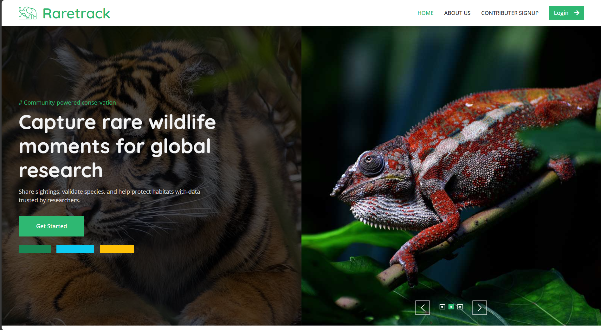
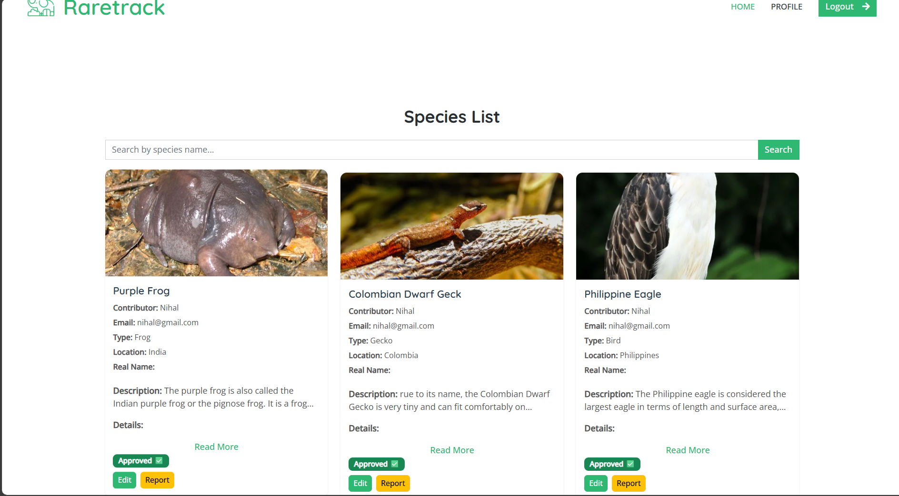
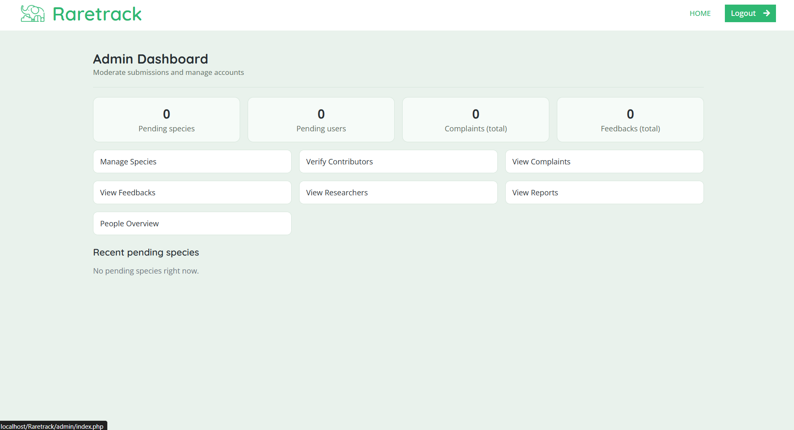

# 🐾 RareTrack

A web‑based platform for **crowd‑sourced wildlife sighting reports**, allowing contributors to upload wildlife photos, researchers to verify sightings, and the public to explore verified wildlife data. RareTrack strengthens wildlife conservation through community participation and transparent data verification.

---

## 🌍 Overview

RareTrack provides:

* Verified wildlife sighting records
* Role‑based access (Contributor, Researcher, Admin)
* Clean, responsive UI
* Secure storage of images and reports
* A public gallery for education and awareness

---

## 🚀 Features

### 👤 Contributor

* Upload wildlife photos with species name, description, date & geo‑location
* Track status of submitted reports (Pending, Verified, Rejected)
* Earn achievements for contributions

### 🔬 Researcher

* Verify, approve, or reject wildlife sightings
* Add scientific notes for each approved sighting
* Manage species database

### 🛠️ Admin

* Manage researchers
* Approve/verify contributor accounts
* Oversee system reports & user feedback

### 🌐 Public

* Browse verified species
* Like & comment on sightings

---

## 📁 Project Structure

```
Raretrack/
├── admin/
├── contributor/
├── researcher/
├── assets/
│   └── screenshot/
│       ├── homepage.png
│       ├── contributorsubmit.png
│       ├── speciesverification.png
│       ├── admindashboard.png
│       └── demo.gif
├── sql/
│   └── raretrack_db.sql
├── connection.php
├── index.php
└── README.md
```

---

## 🛠️ Technologies Used

* **PHP** – Backend scripting
* **MySQL** – Database
* **Bootstrap** – Frontend UI
* **JavaScript** – Dynamic components
* **Apache (XAMPP/LAMP)** – Server

---

## 🔧 Getting Started

### 1️⃣ Clone the Repository

```bash
git clone https://github.com/yourusername/RareTrack.git
cd RareTrack
```

### 2️⃣ Start Web Server

Use **XAMPP** or **LAMP**. Enable:

* Apache
* MySQL

### 3️⃣ Import the Database

1. Visit `http://localhost/phpmyadmin`
2. Create a database (e.g., `raretrack_db`)
3. Import `sql/raretrack_db.sql`

### 4️⃣ Configure Database

Edit `connection.php`:

```php
$con = mysqli_connect("localhost", "root", "", "raretrack_db");
```

### 5️⃣ Run the Project

Move the entire folder to:

```
C:/xampp/htdocs/Raretrack
```

Then visit:

```
http://localhost/Raretrack/
```

---

## 📘 Usage Workflow

### 🧑‍🦰 Contributor → 🔬 Researcher → 🌐 Public

1. Contributor submits a wildlife sighting
2. Researcher verifies and approves
3. Approved sighting appears in public gallery
4. Public users can like/comment

---

## 📸 Screenshots

### 🏠 Homepage



### 📤 Contributor – Submit Sighting


### 🔍 Researcher – Species Verification



### 🛠️ Admin Dashboard



---

## 🎬 Demo GIF

A short GIF showing the full flow: contributor submits → researcher verifies → gallery updated.


---

## 🔐 Security Notes

* Use `password_hash()` and `password_verify()`
* Validate & sanitize file uploads
* Use prepared SQL statements to avoid SQL injection
* Mask exact GPS location for sensitive species

---

## 🚧 Future Enhancements

* AI‑based species prediction
* Mobile app with offline submission
* Heatmaps & analytics dashboards
* Multi‑language support
* API for external wildlife databases

---

## 👥 Contributors

* **Rishal** — Team Lead, Developer
* **Nihal**
* **Lizan**

---

## 📄 License

Licensed under the **Apache‑2.0 License**.
